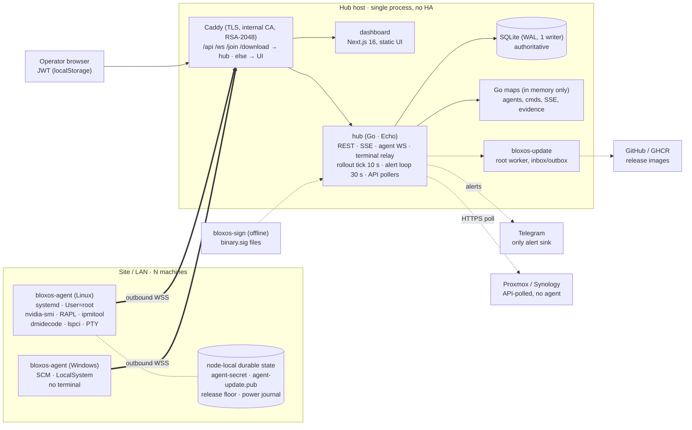
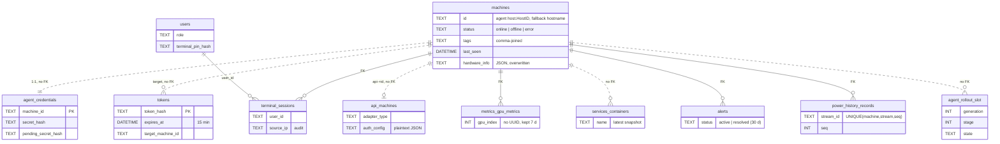
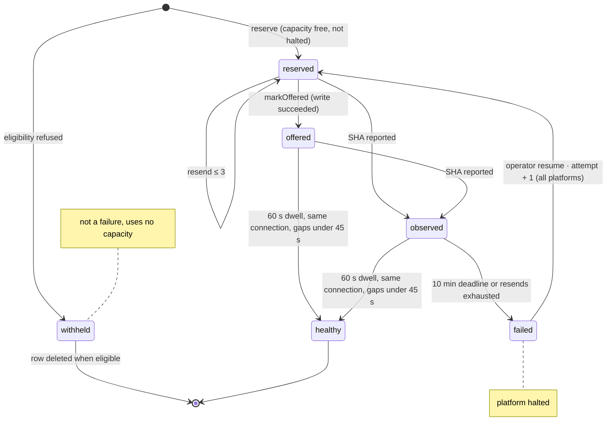
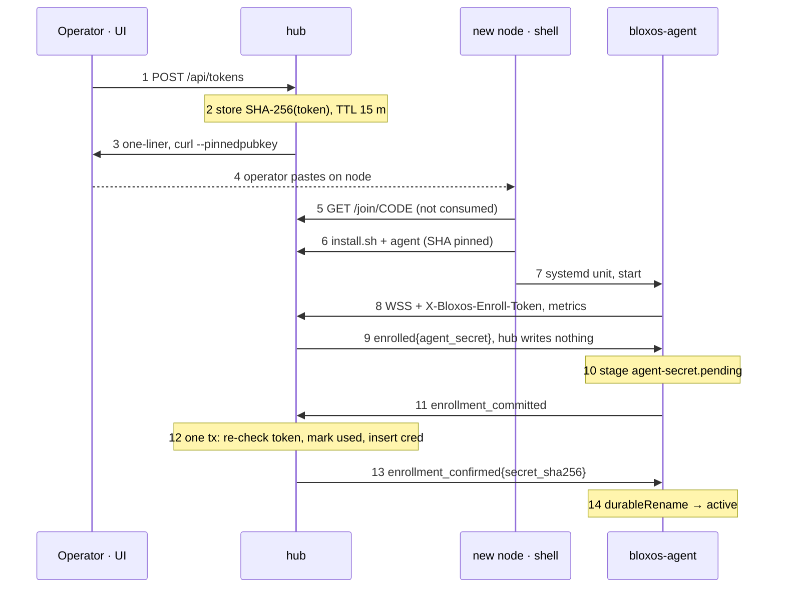
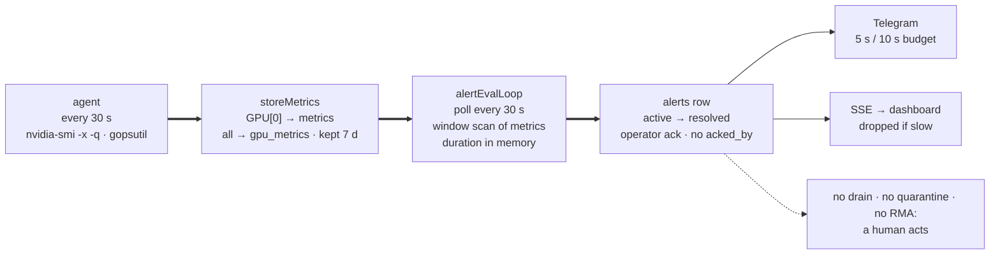
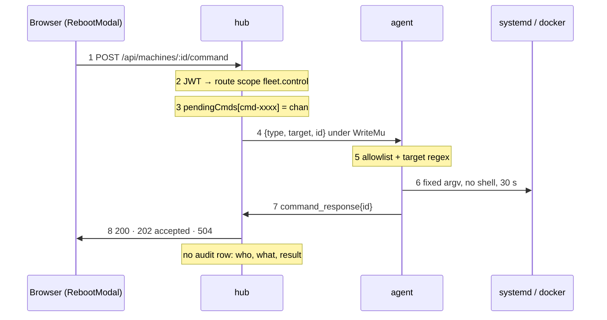
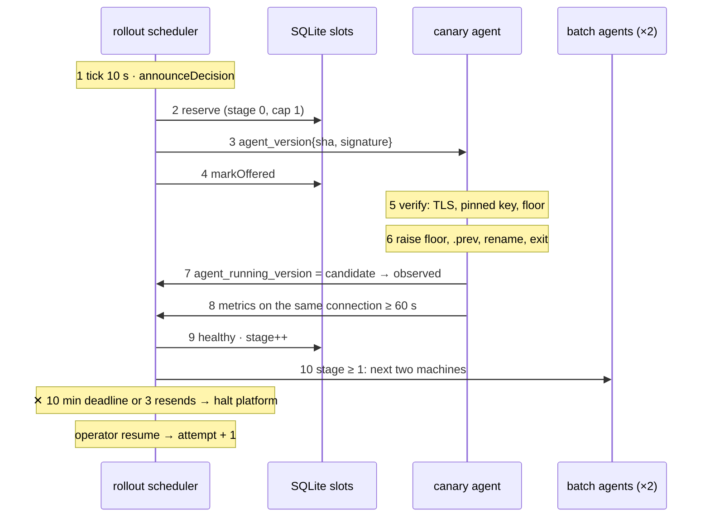

# BloxOS through a GPU-cloud management-plane lens

*Architecture review · bokiko/bloxos*

BloxOS is a self-hosted dashboard for a small fleet of AI and home-lab machines. It has three parts: a single Go hub that stores everything in SQLite, a native Linux/Windows agent that dials home over WebSocket, and a Next.js UI. It monitors machines, runs a handful of allowlisted commands, opens web terminals, and rolls out signed agent updates.

> **Verdict for us:** a poor fit as a platform, and a good source of a few well-built mechanisms. It has no site, rack or topology model, no node state machine, no plugins, no audit log, no MCP, and it runs as a single process on SQLite. Borrow three things: the staged, telemetry-gated rollout controller; the two-phase enrollment handshake; and the at-least-once, ACK-after-commit telemetry journal.

| | |
|---|---|
| SHA | `fcafbb3` |
| Last commit | 2026-09-29 |
| Languages | Go ≈ 29.5k LOC + 34k test · TS/TSX ≈ 20k · Python ≈ 9.5k (scripts) |
| License | Apache-2.0 |
| **Unverified** | Shallow clone: 50 commits (2026-09-07 → 09-29), so contributors and cadence cannot be verified |
| **Unverified** | No git tags in clone; release numbers taken from commit messages (v1.2.1 → v1.7.6 in Sept) |

Diagrams are Mermaid and render on GitHub. The HTML version (`bloxos-architecture.html`) has the hand-drawn SVG versions.

## Contents

1. [In one screen](#1-in-one-screen)
2. [Topology](#2-topology)
3. [Domain model](#3-domain-model)
4. [Lifecycle](#4-lifecycle)
5. [Flow traces](#5-flow-traces)
6. [Key components](#6-key-components)
7. [Key design decisions](#7-key-design-decisions)
8. [Answers to the review questions](#8-answers-to-the-review-questions)
9. [Adoption cards](#9-adoption-cards)
10. [Fit matrix](#10-fit-matrix)
11. [Anti-patterns & limitations](#11-anti-patterns--limitations)
12. [Open questions / spike ideas](#12-open-questions--spike-ideas)
13. [Appendix](#13-appendix)

---

## 1. In one screen

This is a single-tenant fleet monitor, not a management plane. A few of its subsystems are engineered far beyond the rest of the product, and those are the parts worth studying.

- **Agents dial home; the hub never connects in.** Each agent opens an outbound WSS to `/ws/agent` and sends a ping every 30 s. The hub keeps an in-memory registry of whichever connection currently owns each machine. Commands, update announcements and ACKs all travel back over that one socket.
  *Evidence:* `hub/agentws.go:857` `handleAgentWS`, `:103` `registerAgentConnection`
- **Agent rollouts are a durable, gated reconcile loop.** The loop updates one canary per platform first, then batches of two. A node counts as healthy only after 60 s of unbroken telemetry on the connection that reported the new build. One failure halts that platform until an operator resumes it.
  *Evidence:* `hub/agent_rollout.go:37-89`, `:703` `dwellSatisfied`
- **Enrollment writes nothing until the node has durably saved its credential.** The hub issues the credential, the agent stages it on disk, the agent commits, and only then does the hub consume the token and confirm. If an install is interrupted, the same one-line command can simply be run again.
  *Evidence:* `hub/agentws.go:1208`, `:1525`, `:1739`
- **Telemetry from the node is at-least-once and idempotent.** The power journal records a stream id and a durable sequence number, and marks gaps explicitly. The hub sends its ACK only after the database commit, and a `UNIQUE(machine, stream, seq)` constraint deduplicates replays.
  *Evidence:* `agent/power_journal.go:409`, `hub/power_history.go:376`
- **There is no lifecycle and no inventory model to borrow.** `machines.status` is a free-text column holding online, offline or error. Hardware arrives as a JSON blob that replaces the previous one wholesale, with no history. There are no sites, racks, maintenance state or automated remediation.
  *Evidence:* `hub/migrations.go:24`, `hub/agentws.go:2185`
- **Authorization is route-scoped RBAC, and audit covers terminals only.** There are three roles and fourteen scopes, and a boot-time check fails startup if any `/api` route lacks a scope. Commands, bulk actions and admin changes are not audited.
  *Evidence:* `hub/rbac.go:17-160`, `:276`, `hub/main.go:1408`

---

## 2. Topology

One hub host runs Caddy, the hub and the dashboard. Agents connect outbound to it, and there is no per-site tier. The hub is a single process that keeps authoritative state in SQLite and live coordination state in Go maps.

*Legend: thick arrow = agent control channel (agent-initiated); solid = internal call; dotted = external or optional integration.*

**The only connection that crosses a site boundary is initiated by the agent.** Everything else runs on one host. No per-site proxy exists, and nothing queues commands for a disconnected node. The hub's host operations go through a separate root worker, so the hub itself never runs them (`hub/system_update.go:3-7`).

---

## 3. Domain model

There is one entity that matters: `machines`. Their machine ≈ our node, but it has none of our physical hierarchy (site → rack → node → GPU/NIC), and its identity is whatever the agent asserts.

*Solid line = FK (no cascade; delete is hand-coded). Dotted line = logical link, no FK.*

Lost on restart (in memory only): agents registry (connection owner), `pendingCmds`, SSE clients, rollout dwell evidence, AI-session snapshots, running agent versions.
Authoritative on the node: release floor, power journal, `agent-secret` (+ `.pending`).

**SQLite is the source of truth for everything except live connections and node-side safety state.** There are no site, rack, PDU, NIC-fabric or GPU entities. GPUs exist only as rows keyed by `gpu_index` inside metrics, plus a JSON blob. Delete is a manual multi-table transaction (`hub/main.go:830`).

### What the code confirms

- **Identity is self-asserted.** `getMachineID()` returns gopsutil `HostID` and falls back to the hostname (`agent/main.go:1176`). The hub accepts it from the first metrics frame and binds it to the credential only after enrollment (`hub/agentws.go:1139-1140`). Serial numbers are collected (`agent/hardware_types.go:56-57`) but never used for identity. *Inferred risk: cloned images that share `/etc/machine-id` would collide.*
- **Physical and logical state are not separated.** The hardware snapshot, live status, tags and notes are all columns on one row. `hardware_info` is overwritten on every connect (`hub/agentws.go:2185-2193`), and nothing keeps history or detects drift.
- **Grouping is a comma-joined `tags` string** (`hub/main.go:818`). API machines reuse `tags` to hold their adapter type (`hub/main.go:2828`).
- **Discovery:** the agent pushes one hardware snapshot per connect (`agent/main.go:759`), built from dmidecode, lspci and sysfs. It collects no GPU serial or UUID in inventory; the GPU UUID appears only as a power-stream key (`agent/power_nvidia.go:49`). There is no Redfish, and the BMC is used only for DCMI power reads (`agent/power_sources_linux.go:54-88`).

---

## 4. Lifecycle

Machines have no lifecycle state machine. The only explicit, guarded state machine in the repo tracks each machine's slot in an agent rollout. It is still the most transferable piece of design here.

Machine status is `online`, `offline` or `error`. Every metrics frame sets `online` (`hub/main.go:980-995`). Disconnect sets `offline`, but only when this socket still owns the registry entry (`hub/agentws.go:126-151`). An API poll failure sets `error` (`hub/main.go:1067`). Nothing reconciles status on startup: `hub/main.go:1076` is the only statement that marks a machine offline, so after a hub crash a row can read `online` until the alert rule notices a stale `last_seen`.

**The guards live in SQL `WHERE` clauses, which makes every transition a compare-and-swap.** Each platform row has a generation, a stage and a status of active or halted. Stage 0 has capacity 1 (the canary), and every later stage has capacity 2 (`hub/agent_rollout.go:50-51,188`). A new candidate SHA starts a new generation, so rows from an old generation are never reused (`:251-289`).

### Transition guards (code)

| Transition | Where | Guard |
|---|---|---|
| none → reserved | `reserve` `hub/agent_rollout.go:322` | Platform not halted, and fewer outstanding slots than the stage allows. Runs in one transaction. |
| reserved → offered | `markOffered` `:499` | `WHERE attempt=? AND state='reserved'`, run after the socket write succeeds. |
| reserved\|offered → observed | `observeRunningCandidate` `:491` | The agent's own version report says it runs the candidate. The hub's announcement alone never counts. |
| outstanding → healthy | `tick` `:790`, `dwellSatisfied` `:703` | Evidence comes from the currently registered connection, the last frame is under 45 s old, and the dwell is at least 60 s measured between frames on hub receive time. |
| outstanding → failed | `tick`, `failSlotTx` `:541` | The 10 min deadline passes, or all 3 resends are used. Either halts the platform. |
| stage → stage+1 | `:866` | A single atomic `UPDATE` that requires no outstanding slots and at least one healthy slot. |
| failed → reserved | `resumeTx` `:1055-1077` | Operator only. There is no cap on attempts, and resume applies to every platform (`hub/agent_versions.go:1058`). |

---

## 5. Flow traces

Four flows, closest to our domain first. Onboarding and rollout are carefully engineered. The health path stops at a notification, and the user-action path leaves no audit trail.

### A · A node being onboarded

**The token is consumed only after the node proves it has saved the secret durably.** Any crash before step 12 leaves the token usable. Once step 12 has committed, a lost confirmation is repaired on reconnect by hash match.

1. **hub** — `handleCreateToken` `hub/agentws.go:158` requires `PUBLIC_URL` and a servable agent binary, then classifies the CA. Rate limit is 3/min (`:160`).
2. **hub** — stores the token hash with a 15-minute TTL plus a mint-time base/CA binding (`hub/join.go:61`, `hub/agentws.go:223`).
3. **hub** — `buildLinuxJoinCommand` `hub/join.go:498`. Behind a private CA the command pins the leaf's SPKI (`curl -k --pinnedpubkey`). If the hub cannot obtain a pin, it returns 503 and mints nothing.
4. **operator** — runs the one-liner on the node. The script is downloaded whole before any of it executes (`docs/architecture.md`, "One-line Linux onboarding").
5. **hub** — `handleJoinScript` `hub/join.go:599` → `joinCodeUsable` `:528`. The GET never consumes the code, and every unusable code gets the same 404.
6. **hub** — `handleInstallScript` `hub/agentws.go:326` serves the script, and the script checks the binary's SHA.
7. **node** — writes a unit with `User=root` and `Environment="BLOXOS_TOKEN=…"`, plus `OnFailure=` recovery, then restarts the service (`hub/agentws.go:505-513,580`).
8. **agent** — `runAgent` `agent/main.go:573` dials with the enroll-token header (`:629-634`). Hub `handleAgentWS` `hub/agentws.go:857` validates the token (`:929`) inside a fixed 30 s auth window (`:843`).
9. **hub** — sees a valid token and no existing credential, so it generates a secret and sends `enrolled` without writing it (`hub/agentws.go:1208-1229`). *Caveat: the same metrics frame has already upserted a `machines` row (`:1285-1301`).*
10. **agent** — `handleEnrolledFrame` `agent/credential_handoff.go:152` writes `agent-secret.pending` atomically.
11. **agent** — sends `enrollment_committed` (`agent/main.go:667-673`).
12. **hub** — `consumeTokenAndStoreCredential` `hub/agentws.go:1739`, one transaction. Then `registerAgentConnection` and `completeAuth` run, and held hardware and version reports are flushed (`:1560-1577`).
13. **hub** — sends `enrollment_confirmed{secret_sha256}` (`:1578`).
14. **agent** — `handleEnrollmentConfirmed` `agent/credential_handoff.go:222` promotes the secret with a hash-matched `durableRename`.

> **Docs vs code:** the comment on `agent/main_linux.go:186-190` says a stale token "never persists past a successful install". But the generated unit keeps `BLOXOS_TOKEN` (`hub/agentws.go:513`), and on Linux the wipe is a no-op, so every restart re-sends a token that has already been consumed. That is harmless because the token is spent, but the comment is wrong.

### B · A health failure detected and acted on

**The health path ends in a message; nothing changes state automatically.** Rules cover only `cpu`, `ram`, `disk`, `gpu_temp` and `machine_offline` (`hub/alerts.go:212-258`). The agent collects no Xid, ECC, throttle, NVLink, DCGM or InfiniBand signals.

1. **agent** — a 30 s ticker (`agent/main.go:733`) calls `sendAll` (`:785-795`). GPU data comes from forking `nvidia-smi -x -q` (`collectGPUMetrics` `:1226`), not from NVML.
2. **hub** — `storeMetrics` `hub/main.go:1007` copies `GPUs[0]` into the `metrics` row (`:1010-1014`) and writes every GPU to `gpu_metrics` (`:1038`).
3. **hub** — `alertEvalLoop` `hub/alerts.go:84` → `evaluateAlertsAt` `:105` runs a `ROW_NUMBER() OVER (PARTITION BY machine_id)` scan (`:118-132`). Pending durations live in an in-memory map (`:264-274`). `gpu_temp` reads the GPU[0] column, so alerts only ever cover GPU 0.
4. **hub** — inserts an `alerts` row when a rule opens (`:279`) and sets `resolved_at` when it clears (`:323`).
5. **hub** — `sendTelegramBatch` `:441` runs after the lock is released, with no retry. The SSE `alert` event is dropped for slow clients (`:410-425`).
6. Offline detection has two parts. The socket read deadline is 90 s (`hub/agentws.go:855`), after which `markOffline` runs (`hub/main.go:1075`). Separately, the alert rule compares `now − last_seen` against 120 s (`hub/alerts.go:241-256`).

### C · A user action from UI to the thing that changes

**The API is honest about whether a command was delivered, and silent about who sent it.** A reboot that severs the socket returns `202 accepted` rather than claiming success. There is no job record, no idempotency key and no audit entry.

1. **UI** — `RebootModal.tsx:31` sends a POST with `{type:"reboot"}` and a Bearer JWT taken from localStorage (`dashboard/src/lib/session.ts:9-14`).
2. **hub** — the protected group applies `jwtMiddleware → credentialRotationMiddleware → permissionMiddleware` (`hub/main.go:309`). The role is re-read from the DB on every request (`hub/rbac.go:162`).
3. **hub** — `handleCommand` `hub/main.go:1408` returns 404 if the agent is not connected. Otherwise it registers a one-slot channel in the global `pendingCmds` map.
4. **hub** — forwards `req.Type` without validating it (`:1445`) and writes under `agent.WriteMu`.
5. **agent** — checks `allowedCommands` (`agent/main.go:132-142`) and the target regex `^[a-zA-Z0-9._-]+$` (`:129`).
6. **agent** — `commandPlanForIdentity` `agent/command_plan.go:174` builds a fixed argv with no shell, a 30 s timeout, and a process-group kill.
7. **agent → hub** — the `command_response` is matched by id (`hub/agentws.go:1507-1523`).
8. **hub** — waits 10 s, or 2 s for commands that sever the socket (`hub/command_feedback.go:10-30`). On timeout it returns 202 `accepted` for a reboot, shutdown or self-restart, and 504 otherwise (`hub/main.go:1476-1481`).

Bulk (`handleBulkCommand` `hub/main.go:601`) accepts at most 100 targets and runs at most 20 at once (`:583-590`). Results come back synchronously when the whole batch finishes. Cancellation happens only when the client disconnects, and the result distinguishes "not sent" from "completion unknown" (`:597-598`).

### D · A desired-state change being reconciled (agent release)

**Desired state is a candidate SHA per platform. Actual state is what each agent reports on its live connection.** The scheduler is level-triggered: it ticks every 10 s, is woken on registration, and re-evaluates withheld machines on every tick.

1. **hub** — the scheduler loop (`hub/server.go:149-167`) calls `announceVersionToAgent` `hub/agent_versions.go:259`, which calls `announceDecision` `:539`. If the machine is ineligible it is recorded as withheld with a reason such as `agent_key_not_pinned` or `agent_arch_not_reported`.
2. **hub** — `reserve` `hub/agent_rollout.go:322` takes the slot in one transaction.
3. **hub** — the pause flag and SHA are re-checked at the send boundary under `operatorRolloutMu` (`agent_versions.go:400-403`), and `claimSend` (`:760`) prevents a double send.
4. **hub** — `markOffered` `:499`. If the hub crashes between the write and the mark, the slot stays `reserved` and is settled later, either by the agent's report or by a bounded resend (`:380-414`).
5. **agent** — `authorizeUpdate` `agent/update_verify.go:171` requires wss/https (plaintext is allowed only on loopback), a valid Ed25519 signature over `bloxos-agent-update:v1:<os>:<sha>` (`proto/updatesigning/signing.go:18`) checked against the pinned key, and a readable release floor.
6. **agent** — `performUpdate` `agent/updater.go:164` downloads (250 MB cap), checks the SHA and ELF architecture, and raises the floor *before* the swap (`:212`). It then saves `.prev`, renames the new binary into place, writes the marker and exits. systemd `OnFailure` restores `.prev` if the service fails three times within 60 s.
7. **hub** — `observeRunningCandidate` `:491` runs when the agent reports the candidate SHA.
8. **hub** — `noteMetrics` `:622` restarts the dwell after any gap longer than 45 s.
9. **hub** — `tick` `:790` marks the slot healthy, and the stage advances with an atomic `UPDATE` (`:866`).
10. Later stages proceed two machines at a time. Any failure calls `failSlotTx` `:541` and the platform halts. Operator pause and resume go through `/api/versions/pause|resume` and require the `fleet.admin` scope (`hub/rbac.go:102-103`).

---

## 6. Key components

The hub is a single Go `package main`, about 18.7k lines of non-test code with even more test code. A refactor into 11 packages is proposed but only partly done (`BLOXOS_FUTURE.md`).

| Component | Responsibility | Tech | Key files | Talks to |
|---|---|---|---|---|
| Agent socket | Auth window, enrollment, frame dispatch, registry ownership | gorilla/websocket | `hub/agentws.go` | agents, SQLite, rollout |
| Rollout controller | Staged, durable, telemetry-gated agent releases | Go + SQL CAS | `hub/agent_rollout.go`, `agent_versions.go`, `rollout_pause.go`, `release_policy.go` | agent socket, SQLite |
| Update signing | Detached, stored or hub-held Ed25519 signatures | ed25519 | `hub/update_signing*.go`, `hub/cmd/bloxos-sign`, `proto/updatesigning` | filesystem |
| HTTP API + SSE | Routes, commands, bulk, SSE fan-out, API pollers, retention | Echo v4 | `hub/main.go` (2,966 lines) | dashboard, agents |
| Auth / RBAC | JWT login, PIN, rate limits, route→scope map, boot audit | HS256 JWT, bcrypt | `hub/auth.go`, `hub/rbac.go` | users table |
| Alerts | Threshold rules, incidents, Telegram | polling loop | `hub/alerts.go` | metrics table, Telegram, SSE |
| Power history | Journal ingest, dedupe, gaps, ACK-after-commit | SQL tx | `hub/power_history.go`, `proto/powerhistory` | agents |
| Onboarding | Tokens, join link, SPKI pin, installers | bash / PowerShell templates | `hub/join.go`, `hub/install_commands.go`, `hub/windows_installer.go` | new nodes |
| Terminal relay | PIN-gated PTY relay, metadata audit | WS pump | `hub/terminal.go` | browser, agent |
| Host updater | Upgrades hub and dashboard with backup and rollback | Python, files as IPC | `hub/system_update.go`, `scripts/updater/` | GHCR, Docker |
| Agent core | Collectors, command plan, credentials | gopsutil, nvidia-smi, creack/pty | `agent/main.go`, `command_plan.go`, `credential_handoff.go`, `hardware*.go` | hub, OS |
| Agent updater | Verify, floor, atomic swap, recovery | Go, systemd, SCM | `agent/updater*.go`, `update_verify.go`, `release_floor.go` | hub /download |
| Power journal | Durable local buffer with seq and ACK | NDJSON segments, fsync | `agent/power_journal.go`, `power_history.go` | hub |
| Dashboard | Pages, contexts, SSE consumer, command palette | Next.js 16, React 19, cmdk, xterm | `dashboard/src/contexts/SSEContext.tsx`, `components/CommandPalette.tsx` | hub via Caddy |

---

## 7. Key design decisions

The project consistently chooses fail-closed, honest-status designs, and it accepts single-node operation as the price.

<b>Agents initiate every connection over one WebSocket</b>

- **Decision:** a single outbound WSS carries telemetry, commands, update announcements, ACKs and terminal setup.
- **Alternatives:** SSH push from the hub, an inbound agent port, or gRPC.
- **Why:** managed machines need no open inbound port, which works through NAT and on LANs (`README.md`, "How it fits together").
- **Source:** `hub/agentws.go:857`, `agent/main.go:573`

<b>Embedded SQLite, single process, state partly in globals</b>

- **Decision:** modernc SQLite with WAL and `_txlock=immediate`. The registry, pending commands and SSE clients live in Go maps.
- **Alternatives:** Postgres with a stateless hub.
- **Why:** zero-dependency self-hosting. HA is an explicit non-goal (`BLOXOS_FUTURE.md`, "Non-Goals").
- **Source:** `hub/database.go:13`, `hub/main.go:121-143`

<b>Consume the enrollment token only after the node commits the credential</b>

- **Decision:** four steps: issue, stage, commit, confirm. A GET never consumes a join code.
- **Alternatives:** consume on first use, as most bootstrap tokens do.
- **Why:** an interrupted install can re-run the same command, and a crash never produces an orphaned credential.
- **Source:** `hub/agentws.go:1208,1525,1739`, `docs/architecture.md`

<b>Linear canary rollout: halt on any failure, and only a human resumes</b>

- **Decision:** one canary per platform, then flat batches of two. Health means continuous telemetry on the same connection. There is no automatic breaker.
- **Alternatives:** percentage waves, an automatic error-budget breaker, or unconditional push.
- **Why:** nodes that brick themselves cannot be recovered remotely, so the rollout prefers slow and safe.
- **Source:** `hub/agent_rollout.go:37-70`, `docs/architecture.md` "Update Flow"

<b>"Withheld" is distinct from "failed"</b>

- **Decision:** an eligibility refusal (no signature, unpinned key, plaintext transport, arch unknown, floor mismatch) records a reason. It does not use capacity or halt the platform.
- **Alternatives:** treat it as a failure, or skip the machine silently.
- **Why:** it keeps the halt signal about real breakage while still showing operators why a machine is stuck.
- **Source:** `hub/agent_rollout.go:84-88`, `hub/agent_versions.go:539`

<b>Nodes verify releases against a pinned key and enforce a monotonic floor</b>

- **Decision:** Ed25519 over `(os, sha)`. The release number is embedded in the signed bytes. The floor is persisted before the swap and never lowered by `.prev` recovery.
- **Alternatives:** trust TLS to the hub, or sign on the hub only.
- **Why:** a compromised hub cannot push arbitrary or older binaries when signatures are made offline.
- **Source:** `agent/update_verify.go:171`, `agent/release_floor.go:325`, `hub/update_signing.go:38-47`

<b>Report a command as "accepted, unconfirmed" when completion cannot be observed</b>

- **Decision:** a command that may sever the socket returns 202 with `accepted:true, success:false`. Bulk results return accepted, success and error separately for each machine.
- **Alternatives:** report optimistic success, or a timeout error.
- **Why:** a reboot acknowledgement does not prove the machine came back.
- **Source:** `hub/command_feedback.go:10-30`, `hub/main.go:1476`

<b>Telemetry semantics: missing is not zero, and nothing is estimated</b>

- **Decision:** power domains stay disjoint and are never summed, with a `sources` label on each. Lost windows are declared as gaps. Protocol changes are additive only.
- **Alternatives:** interpolate, or sum domains.
- **Why:** an honest reading is worth more than a complete-looking chart. Old agents send old buckets forever.
- **Source:** `AGENTS.md`, `docs/power-history.md`, `hub/power_history.go:430-490`

<b>The hub never runs host operations itself</b>

- **Decision:** upgrades are requested with an O_EXCL request file in an inbox. A root worker stages, backs up, verifies and rolls back, and a maintenance flag gates the API with 503.
- **Alternatives:** give the hub the Docker socket or root.
- **Why:** it keeps the internet-facing process unprivileged.
- **Source:** `hub/system_update.go:3-7,201,315,331`

---

## 8. Answers to the review questions

Short answers to each question. Where the repo has nothing, the answer is "not addressed".

### Domain model & source of truth

- **Entities and storage:** see [domain model](#3-domain-model). Everything is in SQLite (`hub/migrations.go`). There are no CRDs, no etcd and no DCIM.
- **Authoritative vs cached:** SQLite is authoritative. Live connection ownership, pending commands, rollout dwell evidence and AI sessions are in memory only (`hub/migrations.go:560-565`). The release floor and power journal are authoritative on the node.
- **Physical vs logical:** not separated. There is one row and one JSON blob.
- **Discovery and reconciliation:** the agent pushes a snapshot on every connect, which overwrites the stored one. There is no reconciliation or drift detection.

### Lifecycle & orchestration

- **State machine:** none for machines. Rollout slots have one ([see above](#4-lifecycle)), with SQL compare-and-swap guards.
- **Style:** in-process reconcile loops (rollout every 10 s, alerts every 30 s, API pollers) plus synchronous request/response commands. No workflow engine, queue or event sourcing.
- **Long, failure-prone steps:** only the agent self-update is treated as one. It has deadlines, bounded resends, extension of deadlines after a hub restart (`reconcileAfterRestart` `hub/agent_rollout.go:221`), and `.prev` recovery on the node. Firmware, OS images and burn-in are not addressed.
- **Bulk safety:** rollout uses a canary and batches of 2 and halts on failure. Bulk commands allow at most 100 targets with 20 in flight, and have no canary or blast-radius control.

### Provisioning & hardware

- **Protocols:** host agent plus shell bootstrap. There is no IPMI control, no Redfish, no PXE or DHCP, and no cloud-init. `ipmitool` is used only for DCMI power readings.
- **Push or pull:** the agent always initiates the connection, and the hub pushes frames down it. The hub pulls only from Proxmox and Synology APIs.
- **Images and firmware:** not addressed. The only artifact managed is the agent binary (signed and floored). Hardware drift is not addressed.

### Health, validation & observability

- **Signals:** `nvidia-smi` XML for temperature, utilisation, memory, power and fan; RAPL and DCMI for power; gopsutil for the host. No DCGM, Xid, ECC, throttle reasons, NVLink or InfiniBand.
- **Signal → state change:** not addressed. Alerts notify but never drain or quarantine.
- **Burn-in and validation:** not addressed. The closest thing is the 60 s telemetry dwell used as a post-update health gate.
- **Metrics, logs and traces:** `log.Printf` plus the Echo access log with token redaction (`hub/main.go:234-237`). No Prometheus endpoint, OpenTelemetry or pprof.

### API, extensibility & access

- **API style:** REST under `/api` with no version prefix and no OpenAPI spec, plus SSE and WebSockets. The UI calls `fetch` directly from about 18 files. There is no fleet CLI; `bloxos-update` only upgrades the host.
- **Plugins:** none. The closest analogue is API-machine "adapters", which are a string `switch` in `doPoll` (`hub/main.go:2776`) repeated at about 4 other sites. UI actions are hard-coded (`dashboard/src/app/machine/[id]/page.tsx:660-690`).
- **AuthN/AuthZ:** HS256 JWT valid for 24 h with no refresh or revocation (`hub/auth.go:286-292`). Tokens are also accepted as `?token=`. RBAC is 3 roles × 14 scopes with a static route map and a boot-time coverage audit. No tenancy, no service accounts, no token passthrough. Audit covers terminal session metadata only.
- **MCP / AI agents:** not addressed. "AI Sessions" monitors which AI coding tools are running on nodes, through a privacy-minimised contract (`proto/aisessions`).

### Multi-site & scale

- **Topology:** one hub; agents connect directly. No site tier.
- **Disconnected site:** machines go offline after the 90 s idle timeout. Only power history is buffered (24 h, 32 MiB) and replayed. Metrics and commands are not buffered.
- **Limits:** a single SQLite writer, an alert scan every 30 s over 7 days of metrics, SSE broadcast to every client with 64-deep buffers that drop events, a full snapshot on each SSE connect, and one `nvidia-smi` fork per node every 30 s. *Inferred: with flat batches of 2 and a ≥ 60 s dwell, a 1,000-node platform takes ≈ 500 stages, roughly 10+ hours per release.*

### Operability & maturity

- **Deploy:** Docker Compose (Caddy, hub, dashboard) or native systemd units. Multi-arch images are published to GHCR on `v*` tags (`.github/workflows/docker.yml`). Hub upgrades involve downtime and run through the root worker, which backs up and can roll back.
- **Dependencies:** Caddy only. SQLite is embedded. Nodes need `nvidia-smi`.
- **Maturity:** Apache-2.0. In the visible history, 46 of 50 commits are by one author (bokiko) and 4 by Dependabot. Test code outweighs source code in the hub (≈ 25k vs 18.7k lines), and CI runs a race detector. The clone is shallow, so long-run cadence and contributor count are unverified.

---

## 9. Adoption cards

Six ideas are worth taking, and most of them should be re-implemented on Temporal rather than copied. The avoid list is mostly shortcuts that suit a home lab and would fail at our scale.

### Adopt

#### Withheld ≠ failed: typed eligibility refusals — **Adopt**

**How they do it:** before touching a node, `announceDecision` (`hub/agent_versions.go:539`) returns a machine-readable reason such as `agent_key_not_pinned`, `agent_arch_not_reported` or `agent_release_below_floor`. The slot is recorded as `withheld`, which uses no capacity and does not halt the rollout. It is re-evaluated on every tick (`hub/agent_rollout.go:84-88,517`).

**For us:** every bulk action (provision, firmware, image) runs a precondition pass that sorts nodes into eligible, withheld (with a reason code), or failed. Only failures count against the blast-radius budget. The portal shows withheld reasons as a queue of work.

*Maps to:* lifecycle, orchestration · *Effort/risk:* S · reason-code sprawl · *Temporal:* a precondition activity before the child workflow fan-out

#### At-least-once edge telemetry: stream id + seq + ACK after commit — **Adopt**

**How they do it:** the agent reserves blocks of 64 sequence numbers durably before using them and fsyncs every record (`agent/power_journal.go:409-463`). A missing or corrupt state file rotates to a new stream id (`:162-178`), and losses are declared as gaps. The hub commits under `UNIQUE(machine, stream, seq)`: an identical payload is a no-op, and a different one is a conflict (`hub/power_history.go:376,430-445`). The ACK goes out only after commit (`:306-315`), and the hub reads the machine's identity from the authenticated socket rather than the frame.

**For us:** use this as the protocol between site agent and control plane for validation results, burn-in logs and health events, so a site can be disconnected for hours without losing data or double-counting it.

*Maps to:* multi-site, validation · *Effort/risk:* M · disk bounds on the edge · *Temporal:* ingest outside workflows; signal the entity workflow after commit

#### Boot-time check that every route has a permission — **Adopt**

**How they do it:** a static `"METHOD /path" → scope` map (`hub/rbac.go:85-160`). `auditRBACRouteCoverage` (`:276`) refuses to start if any `/api` route is unmapped or any mapping is orphaned, and an unmapped route returns 500 at runtime.

**For us:** extend the idea from routes to actions. Every action a plugin registers must declare a permission, an audit class and a risk tier, or the portal and API refuse to load it. Check this in CI, and when a plugin registers. It also covers the gap they left open: their check skips `/ws/*` (`:280`).

*Maps to:* authz, portal · *Effort/risk:* S · none material · *Portal:* a plugin manifest lint

#### Report accepted, confirmed and unknown as separate outcomes — **Adopt**

**How they do it:** commands that can sever the channel return `202 accepted` with `success:false` (`hub/command_feedback.go:10-30`, `hub/main.go:1476`). Bulk results report accepted, success and error for each machine, and "not sent" is distinguished from "completion unknown" (`:597-598`).

**For us:** every action should return a workflow or run id plus a tri-state outcome in UI, CLI, API and MCP alike. A power cycle through the BMC is "accepted" until the lifecycle workflow sees the node come back.

*Maps to:* portal, orchestration · *Effort/risk:* S · none · *Temporal:* a natural fit with workflow status

#### Health evidence bound to the current connection and the receiver's clock — **Adopt**

**How they do it:** dwell evidence is keyed by the live `*ConnectedAgent`. A reconnect or displacement discards it, time is measured between frames the hub received, and the agent's clock is never used (`hub/agent_rollout.go:622-744`).

**For us:** a validation gate such as "healthy after burn-in" should only count signals from the current boot or session of the node, timestamped by the control plane. That stops stale results from before a reboot from passing the gate.

*Maps to:* validation · *Effort/risk:* S · need a boot or session id in every signal

### Adapt

#### Staged, durable, telemetry-gated rollout controller — **Adapt**

**How they do it:** a slot table keyed by `(platform, generation, machine)` with the states reserved, offered, observed, healthy, failed and withheld. Every transition is a SQL compare-and-swap. The canary stage holds 1, later stages hold 2, a slot is healthy after a 60 s dwell, and one failure halts the platform until an operator resumes. After a restart, deadlines are extended once (`hub/agent_rollout.go:37-89,221,322-556,866`).

**Change:** make it a Temporal "wave" workflow that fans out child workflows per node. Its state lives in workflow history instead of a slot table. Replace the flat batches of 2 with configurable wave sizes and an error budget per failure domain (rack, PDU, fabric leaf). Gate health on DCGM and burn-in results, not just on metrics arriving. Keep the generation idea as the workflow id plus the target artifact digest.

*Maps to:* orchestration, validation · *Effort/risk:* M · slow waves at 10k nodes; a single global resume · *Temporal:* strong fit

#### Two-phase enrollment: issue → stage → commit → confirm — **Adapt**

**How they do it:** the hub creates the secret but persists nothing. The agent writes it to `.pending` and sends `enrollment_committed`. The hub consumes the token and inserts the credential in one transaction, then confirms with a hash, and the agent promotes the secret durably (`hub/agentws.go:1208-1229,1525-1578,1739`; `agent/credential_handoff.go:152,222`). Rotation follows the same pattern with a pending hash and a CAS promote (`hub/agentws.go:1804,1895`).

**Change:** in the racked → provisioning step, bind identity to hardware (chassis serial, TPM EK, BMC-reported serial) rather than to `/etc/machine-id`. The one-time token should come from the provisioning workflow, not from a human. Keep the "nothing durable until the node commits" rule and the non-consuming GET.

*Maps to:* provisioning, inventory · *Effort/risk:* M · attestation plumbing · *Temporal:* the enrollment is an activity inside the node lifecycle workflow; the commit arrives as a signal

#### Signed artifacts with a persistent anti-rollback floor on the node — **Adapt**

**How they do it:** Ed25519 over `bloxos-agent-update:v1:<os>:<sha>`, verified against a pinned key. Signatures can be produced offline, in which case the hub holds no private key. The node raises a `release=/sha256=` floor with fsync and rename *before* swapping binaries, and `.prev` recovery never lowers it (`agent/update_verify.go:171`, `agent/release_floor.go:27-70,325`, `hub/update_signing.go:390-412`).

**Change:** apply it to the firmware and OS-image catalog. Each component (BIOS, BMC, NIC, GPU VBIOS, OS image) gets a signed manifest and a monotonic floor per node, stored in inventory and enforced by the provisioning workflow. Use TUF or Sigstore-style roles instead of one key, because they note that a compromised key can still authorise a malicious higher-numbered binary.

*Maps to:* provisioning · *Effort/risk:* M · vendor firmware that cannot be verified

#### Outbound-only agent channel with single-owner registry — **Adapt**

**How they do it:** one WSS per node. `registerAgentConnection` closes any socket it displaces (`hub/agentws.go:103`). A fixed 30 s auth window precedes a 90 s idle deadline (`:843,855`). Writes are serialised per connection, and every frame re-checks identity binding and registry ownership (`:1116,1126`).

**Change:** put a site gateway in between. Nodes dial the site agent, and the site agent dials the control plane over mTLS gRPC. Registry ownership should use leases in a shared store so the control plane can run more than one replica. Keep the "only the current owner may mutate" check on every message.

*Maps to:* multi-site · *Effort/risk:* M · session affinity across replicas

#### Typed, allowlisted node actions executed without a shell — **Adapt**

**How they do it:** the agent accepts 9 command types and targets matching `^[a-zA-Z0-9._-]+$`. It builds a fixed argv with no shell, runs it with a 30 s timeout, and kills the process group (`agent/main.go:129-142`, `agent/command_plan.go:174-236`).

**Change:** enforce on both sides. Their hub forwards `req.Type` unchecked (`hub/main.go:1445`) and any unit name is accepted, so `stop sshd` is allowed. Our action schema should be declared once and validated in the API, the workflow and the node agent, with target allowlists for each action.

*Maps to:* provisioning, authz · *Effort/risk:* S · none

#### Pinned-SPKI one-line bootstrap with uniform 404s — **Adapt**

**How they do it:** at mint time the hub verifies the leaf certificate `PUBLIC_URL` presents and embeds `--pinnedpubkey sha256//…` in the command. If it cannot get a trustworthy pin, it refuses to mint. Every unusable code gets the same 404, and codes are redacted from logs (`hub/join.go:498-599`).

**Change:** this matters only for manual or edge onboarding. Our main path will be PXE or Redfish virtual media. Reuse the pin-at-mint idea for the iPXE script and the first-boot trust anchor.

*Maps to:* provisioning · *Effort/risk:* S · pin breaks on certificate rotation (they hit this: Caddy re-keys every 12 h)

### Watch

#### Unprivileged control plane, privileged host worker, file-based IPC — **Watch**

**How they do it:** the hub writes an O_EXCL request file into an inbox. A root worker stages, backs up, verifies and accepts or restores, and a maintenance flag file returns 503 for the API (`hub/system_update.go:201,315,331-353`).

**For us:** Kubernetes already covers our own upgrades. The pattern still applies to site appliances that have to update themselves while disconnected.

*Maps to:* multi-site · *Effort/risk:* S · low relevance

#### A shared contract package with a whitelist that re-sanitises on both sides — **Watch**

**How they do it:** `proto/aisessions` is imported by both agent and hub. The hub re-sanitises every frame and takes identity from the socket, ignoring `machine_id` in the frame (`hub/ai_sessions.go`). A revisioned config frame gates the feature, and an agent environment variable is a hard opt-out that the hub cannot override.

**For us:** useful if we put agents or MCP tooling on customer-facing nodes: an explicit data-minimisation contract plus a local opt-out. Use protobuf and buf instead of a Go package.

*Maps to:* authz · *Effort/risk:* S · none

### Avoid

#### Single-process hub: SQLite plus coordination state in globals — **Avoid**

**How they do it:** one writer (`hub/database.go:13`). `sseClients`, `pendingCmds`, `termSessions` and `machineLatency` are package globals (`hub/main.go:121-143`).

**Why avoid:** it rules out HA and more than one replica, and every metrics frame from every node is serialised through one database writer.

*Maps to:* multi-site, inventory · *Risk:* high at our scale

#### Free-text status with no lifecycle or maintenance state — **Avoid**

**How they do it:** `machines.status` has a default of `'offline'` and is overwritten by ingest and disconnect (`hub/migrations.go:24`, `hub/main.go:980,1075`). Nothing reconciles it on startup.

**Why avoid:** connectivity and lifecycle are separate axes. Our node needs a lifecycle state owned by a workflow, and liveness as a separate condition derived from signals.

*Maps to:* lifecycle · *Risk:* silent wrong state

#### Inventory stored as a JSON blob that is overwritten wholesale — **Avoid**

**How they do it:** `ON CONFLICT DO UPDATE SET hardware_info=excluded…` (`hub/agentws.go:2185-2193`), aggregated at read time (`hub/inventory.go:183`). GPUs are identified by index, not by UUID or serial.

**Why avoid:** it loses history, which rules out drift detection and RMA traceability, and a GPU swap looks like no change at all.

*Maps to:* inventory · *Risk:* RMA and warranty tracking impossible

#### Synchronous, in-memory bulk commands — **Avoid**

**How they do it:** at most 100 targets and 20 in flight. The caller waits for `wg.Wait()`. There is no job id, no persistence and no resume, and cancellation happens only when the client disconnects (`hub/main.go:583-758`).

**Why avoid:** this is exactly what Temporal is for.

*Maps to:* orchestration · *Risk:* lost work on restart

#### Integrations as string switches, UI actions as hard-coded lists — **Avoid**

**How they do it:** `doPoll` switches on `"proxmox"` and `"synology"` (`hub/main.go:2776`), and adapter names are repeated at 4 validation sites. Machine actions are an inline array in `page.tsx:660-690`, and palette items are hard-coded.

**Why avoid:** it is the opposite of a plugin shell. We need an action registry with a manifest (permission, input schema, workflow binding) that UI, CLI, API and MCP all consume.

*Maps to:* portal · *Risk:* every team edits core

#### An unfiltered global event stream — **Avoid**

**How they do it:** `broadcastSSE` sends every event to every client under an RLock, with a 64-slot buffer that drops events (`hub/main.go:1089-1100`). A full snapshot is sent on each connect, with no filtering per user or scope.

**Why avoid:** it breaks tenant and scope isolation, and it costs O(clients × nodes).

*Maps to:* portal, authz · *Risk:* data leak, load

---

## 10. Fit matrix

The repo has most to offer on orchestration safety and edge telemetry. On inventory, provisioning protocols, validation and the portal it has almost nothing.

| Our area | Adopt | Adapt | Avoid | Not addressed |
|---|---|---|---|---|
| **Inventory** | — | [two-phase enrollment](#c-enroll) | [JSON blob](#c-hwjson), [single-writer store](#c-sqlite) | sites, racks, PDU/CDU, fabric, cabling, GPU serials, drift |
| **Lifecycle** | [withheld ≠ failed](#c-withheld) | — | [free-text status](#c-status) | node state machine, maintenance, RMA |
| **Provisioning** | — | [signed + floor](#c-floor), [typed actions](#c-allowlist), [pinned bootstrap](#c-join) | — | PXE, Redfish, IPMI control, firmware, OS images |
| **Validation** | [connection-bound evidence](#c-connevidence), [durable results](#c-journal) | [telemetry-gated waves](#c-rollout) | — | burn-in, DCGM diagnostics, NCCL tests, gating records |
| **Portal** | [tri-state outcomes](#c-accepted), [action coverage lint](#c-rbacaudit) | — | [hard-coded actions](#c-adapter), [global SSE](#c-sse) | plugins, CLI, MCP |
| **Orchestration** | [eligibility pass](#c-withheld), [outcomes](#c-accepted) | [rollout controller](#c-rollout) | [sync bulk](#c-bulk) | workflow engine, compensation |
| **Authz** | [route/action coverage](#c-rbacaudit) | [two-sided allowlist](#c-allowlist) | [unfiltered stream](#c-sse) | audit log, service accounts, tenancy, ReBAC, passthrough |
| **Multi-site** | [seq + ACK journal](#c-journal) | [dial-home channel](#c-dialhome) | [single process](#c-sqlite) | site tier, offline command queue |

---

## 11. Anti-patterns & limitations

The serious problems are missing audit, a hub that cannot scale out, and trust placed in the wrong layer. Most of the rest are small-fleet shortcuts.

| Severity | Issue | Explanation | Evidence |
|---|---|---|---|
| 🔴 high | Commands and admin changes are not audited | Only `terminal_sessions` records who did something. `handleCommand` persists neither the actor nor the result, and alerts have no `acknowledged_by`. The README says a full audit log is not shipped. | `hub/migrations.go:96-103,117-128`, `hub/main.go:1408-1489` |
| 🔴 high | The hub is a single process with no HA | SQLite has one writer, and coordination state lives in package globals. The refactor that would make HA possible is itself planned work. | `hub/database.go:13`, `hub/main.go:121-143`, `docs/architecture.md` "Server struct" |
| 🔴 high | The node enforces the command allowlist, and the hub does not | The hub forwards any `type`. On the node, any unit or container name that matches the regex is accepted, so `stop_service sshd` works, and `start_terminal` gives a shell to anyone with a PIN. | `hub/main.go:1445`, `agent/main.go:129-142` |
| 🟠 med | GPU telemetry treats GPU 0 as the node | `metrics.gpu_*` and the `gpu_temp` alert read only `GPUs[0]`. An 8-GPU node overheating on GPU 5 raises no alert. `docs/alerts.md` does not mention this. | `hub/main.go:1010-1014`, `hub/alerts.go:123` |
| 🟠 med | Machine identity is self-asserted | The id is the host ID reported by the node, or its hostname. It is bound to a credential only after enrollment, and a token holder can create a `machines` row before the commit. | `agent/main.go:1176`, `hub/agentws.go:1139,1285-1301` |
| 🟠 med | Status is not reconciled after a crash | Rows stay `online` after a hub crash until the agent reconnects or the alert rule on `last_seen` fires. | `hub/main.go:1075-1076` |
| 🟠 med | Session tokens are long-lived and leak easily | The HS256 JWT is valid for 24 h with no revocation. It is accepted in `?token=` and stored in localStorage. The setup-token comparison is not constant-time. | `hub/auth.go:147,286-292,317-362`, `dashboard/src/lib/session.ts:9-14` |
| 🟠 med | The alert loop scans all metrics | Every 30 s it runs a window function across up to 7 days of `metrics`. It is polling, not evaluation on ingest. | `hub/alerts.go:84-132` |
| 🟠 med | Rollout speed does not scale | Batches are fixed at 2 and resume applies to every platform at once. *Inferred: ≈ 10 h per 1,000 nodes.* | `hub/agent_rollout.go:50-51`, `hub/agent_versions.go:1058` |
| ⚪ low | The Linux self-update is not crash-durable | `.new` is never fsynced, and the swap uses plain `os.Rename` rather than the repo's own `durableRename`. | `agent/updater.go:231,290-301` |
| ⚪ low | Docs and code disagree on recovery and token handling | The sample `scripts/systemd/bloxos-agent.service` lacks the `OnFailure` recovery that the docs rely on; only the unit generated by the installer has it. The comment in `agent/main_linux.go:186-190` about the token not persisting contradicts the generated unit. | `hub/agentws.go:505-513` |
| ⚪ low | API-machine credentials are stored in plaintext | `auth_config` is a JSON TEXT column. | `hub/migrations.go:199-210` |
| ⚪ low | WebSocket routes are outside the RBAC coverage audit | `/ws/terminal` does its own token check. The boot audit only looks at `/api/*`. | `hub/rbac.go:280`, `hub/main.go:339` |

---

## 12. Open questions / spike ideas

Two spikes are worth scheduling: port the rollout controller to Temporal, and prototype the journal protocol through a site gateway. The rest are questions for the maintainers.

1. **Spike (≈ 3 days):** re-implement `agent_rollout.go` as a Temporal wave workflow with per-failure-domain error budgets. Compare the slot table's compare-and-swap guarantees with workflow determinism, especially the case where the hub crashes between the socket write and `markOffered`.
2. **Spike (≈ 2 days):** run the power-journal protocol (stream id, reserved sequence blocks, gap declarations, ACK after commit) through a site gateway with a 6-hour partition, and measure disk use and replay time.
3. **Maintainers:** is HA or Postgres planned at all, or will the 11-package refactor stop at dependency injection?
4. **Maintainers:** why is identity asserted by the node instead of assigned by the hub? What happens when two cloned VMs share `/etc/machine-id`?
5. **Maintainers:** were larger or adaptive batch sizes considered? What failure rate have real canaries caught?
6. **Verify:** the SSE snapshot cost and broadcast drops at 5k–10k nodes. Load-test `getEnrichedMachinesJSON` (`hub/main.go:1159`).
7. **Verify:** the full git history (this clone is shallow) to get real contributor count and release cadence before depending on the project in any way.

---

## 13. Appendix

A small repo. Start with the rollout controller and the enrollment path.

### Repo map

| Path | What it is |
|---|---|
| `hub/` | Go API server, flat `package main`: routes, WebSockets, rollout, alerts, auth, SQLite migrations |
| `hub/cmd/bloxos-sign` | Offline tool that signs agent releases |
| `agent/` | Go agent for Linux and Windows: collectors, command plan, updater, power journal |
| `agent/aiscan` | Pure classifier for AI coding-tool processes |
| `proto/` | Shared contracts: `aisessions`, `powerhistory`, `updatesigning` |
| `dashboard/` | Next.js 16 UI: app routes, contexts, components |
| `scripts/` | Installer, host updater (Python), release and bundle tooling, systemd and Caddy samples |
| `docker/` | Compose stack (Caddy, hub, dashboard) and Caddyfile |
| `docs/` | Architecture, power history, updates, recovery, alerts, configuration |
| `.github/workflows` | CI (race tests, Windows build), multi-arch GHCR release, Dependabot |
| `BLOXOS_FUTURE.md` | Proposed hub refactor into 11 packages, partly superseded |

### Files most worth reading

- `hub/agent_rollout.go`: the durable rollout state machine. The best code in the repo for our purposes.
- `hub/agentws.go` lines 843–1260 and 1525–1960: auth window, enrollment and credential rotation.
- `agent/power_journal.go` and `hub/power_history.go`: at-least-once telemetry with idempotent commit.
- `agent/release_floor.go` and `agent/update_verify.go`: node-side verification and anti-rollback.
- `hub/rbac.go`: route→scope map and boot coverage audit.
- `hub/command_feedback.go`: accepted vs confirmed semantics.
- `docs/architecture.md` and `docs/power-history.md`: accurate prose descriptions of the above.

---

*Reviewed at `fcafbb3` (2026-09-29). Line references were checked against that commit. Claims marked inferred were not confirmed in code.*
